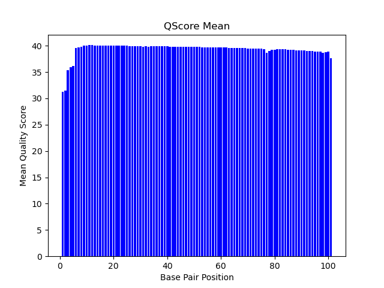
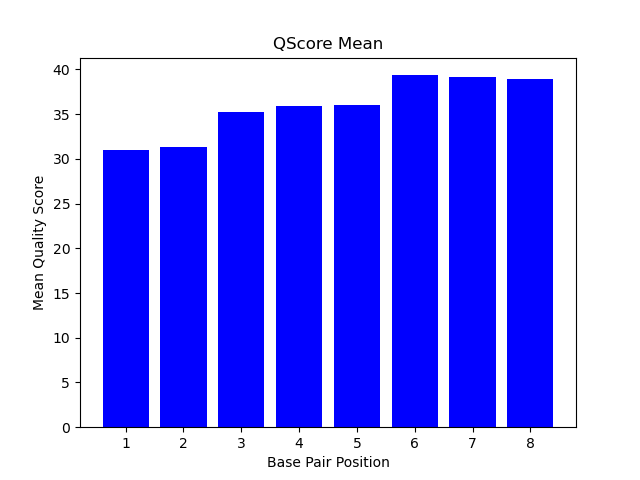
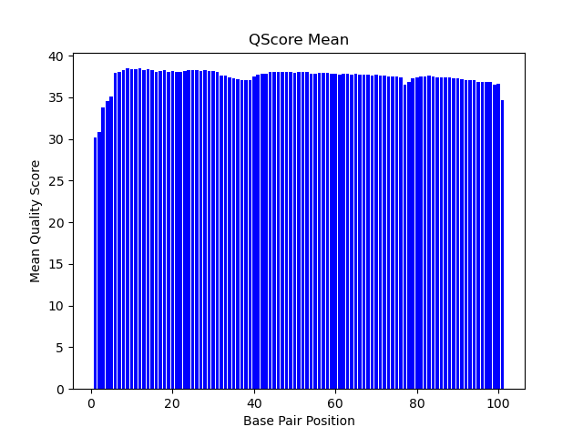

# Assignment the First

## Part 1
1. Be sure to upload your Python script.

Python script located in `./histograms.py`

| File name                    | label           |
|------------------------------|-----------------|
| 1294_S1_L008_R1_001.fastq.gz | forward reads   |
| 1294_S1_L008_R2_001.fastq.gz | forward indexes |
| 1294_S1_L008_R3_001.fastq.gz | reverse indexes |
| 1294_S1_L008_R4_001.fastq.gz | reverse reads   |

2. Per-base NT distribution
    1. Use markdown to insert your 4 histograms here.

    
    
    
    
    
    2. What is a good quality score cutoff for index reads and biological read pairs to utilize for sample identification and downstream analysis, respectively? Justify your answer.

    A good quality score cutoff would be 20 or higher for index reads because they are shorter and it is 99% accurate (1 nt mismatch in 100), and probably a higher cutoff for reads because they are longer, so 30 (99.9% accuracy) would be good. 

    3. How many indexes have undetermined (N) base calls? (Utilize your command line tool knowledge. Submit the command(s) you used. CHALLENGE: use a one-line command)

            $ zcat /projects/bgmp/shared/2017_sequencing/1294_S1_L008_R2_001.fastq.gz | awk 'NR % 4 == 2' | grep "N" | wc -l
            3976613

            $ zcat /projects/bgmp/shared/2017_sequencing/1294_S1_L008_R3_001.fastq.gz | awk 'NR % 4 == 2' | grep "N" | wc -l
            3328051

## Part 2
1. Define the problem

> Divide up the forward and reverse reads into the appropriate sample bins according to their indexes. Account for index hopping, low qscores in indexes, and sequenced indexes that don't match barcode file

2. Describe output

> one FASTQ file containing forward and reverse reads for each adapter (of which there are 24, in this case) + a FASTQ file for index hopping + FASTQ file for records with barcode sequencing errors. 

3. Upload your [4 input FASTQ files](../TEST-input_FASTQ) and your [>=6 expected output FASTQ files](../TEST-output_FASTQ).

4 input FASTQ files: `../TEST-input_FASTQ`

output files: `../TEST-output_FASTQ`

4. Pseudocode

- open barcode file, store barcodes as dictionary, close file. 
- open input files (R1, R2, R3, R4)
- generate/open output files (sample bins [# of barcodes *2], swapping bins [2], dust bins [2])
- calculate # of records (file length of any file, divided by 4)
- start for loop for each record
    - find barcode id for I1 and I2 within barcode dict (=I1.id, I2.id) 
        - if no match, return ""
    - calculate qscores with Bioinfo.convert_phred (=I1.q, I2.q)
        - if I1.q or I2.q < 20, write reads to dust bins
    - elif I1.id or I2.id == "", write reads to dust bins
    - elif I1.id != I2.id, write reads to swapping bins
    - elif I1.id == I2.id, write reads to sample bins
- close output files
- close input files

**for optional read correction:**

- convert barcode dict to tuple of barcodes for bc_correct fxn
- for each barcode in header of formatted output records in dust bin: 
    - isolate 1st barcode seq
    - run bc_correct
    - isolate 2nd barcode seq
    - run bc_correct
    - if 1st or 2nd barcode != "": append record to appropriate sample bin

5. High level functions. For each function, be sure to include:

        def revc (seq: str) -> str:
            '''converts DNA seq to reverse complement'''
            seq=seq.upper()
            nucd = {"A":  "T", "T": "A", "C": "G", "G": "C", "N": "N"}
            rseq=seq.translate(str.maketrans(nucd))[::-1] 
            return rseq
        if __name__ == "__main__":
            assert revc("TGCAGGTT") == "AACCTGCA"
            print("PASS\trevc")

        def bc_correct(qbar_seq: str, barcode_txt: tuple):
            '''input is barcode sequence in question and a tuple of possible
            barcode values, output is corrected barcode or empty string 
            if no correction possible'''
            - determine min hamming dist in barcode tuple and save as variable
                - initialize hamming dist variable as barcode seq length
                - determine hamming dist between each barcode pair
                - if dist < variable, replace
            - open dust bin files (forward and reverse reads)
