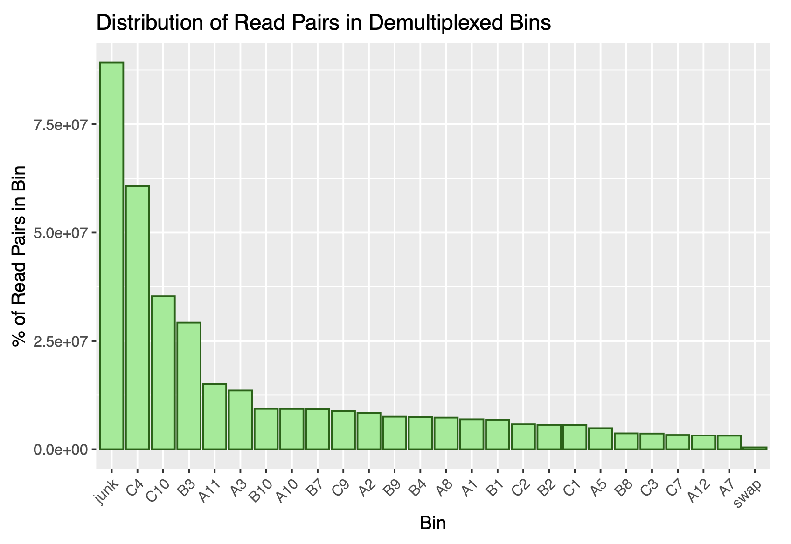

# Demultiplex
> Demultiplexes reads according to barcodes. Use for single-indexed libraries only.

## Table of Contents
* [General Info](#general-information)
* [Screenshots](#screenshots)
* [Setup](#setup)
* [Usage](#usage)
* [Project Status](#project-status)
* [Acknowledgements](#acknowledgements)

## General Information
- The main purpose of this project is to separate (demultiplex) each sample from a single NGS sequencing run. 
- The amount of index swapping and undetermined index-pairs are also determined, before and after quality filtering. 
- The python script will generate 2 "clean" forward and reverse read files for each sample, as well as two FASTQ files with index-hopped reads-pairs, and two FASTQ files undetermined (non-matching or low quality) index-pairs for the entire run. 
- The R markdown script will generate 1 pdf file which is a summary report of the filtering process. 

## Features
- A statistical summary report generated in R markdown

## Screenshots

#### Distribution Plot

## Setup

**Dependencies**

python3.9
> Python packages: argparse, gzip
matplotlib
R
> R packages: knitr

## Usage

**Running the script**

	$ ./demux.py -h
	usage: demux.py [-h] -1 R1_FILE -2 R2_FILE -3 R3_FILE -4 R4_FILE -b
	                BARCODE_FILE [-q MIN_QSCORE] -o OUTPUT_DIR

	Demultiplexes reads according to barcodes. Use for single-indexed libraries
	only.

	optional arguments:
	  -h, --help            show this help message and exit
	  -1 R1_FILE, --R1_file R1_FILE
	                        R1 (forward read) file = normally 'R1'
	  -2 R2_FILE, --R2_file R2_FILE
	                        R2 (forward index) file = normally 'I1'
	  -3 R3_FILE, --R3_file R3_FILE
	                        R3 (reverse index) file = normally 'I2'
	  -4 R4_FILE, --R4_file R4_FILE
	                        R4 (reverse read) file = normally 'R2'
	  -b BARCODE_FILE, --barcode_file BARCODE_FILE
	                        file of barcodes
	  -q MIN_QSCORE, --min_qscore MIN_QSCORE
	                        minimum qscore allowed; default=20
	  -o OUTPUT_DIR, --output_dir OUTPUT_DIR
	                        output folder for fastq files

**Generating the statistical report:**

`Rscript -e 'rmarkdown::render("demux_report.Rmd", params=list(data="REAL-output/bin_counts.csv"))'`

## Project Status
Project is: _complete_ 

## Acknowledgements
- This project was based on instructions given by the University of Oregon's Knight Campus Internship Program for Bioinformatics and Genomics (BGMP)
- Many thanks to the BGMP instructors and fellow classmates for their feedback

